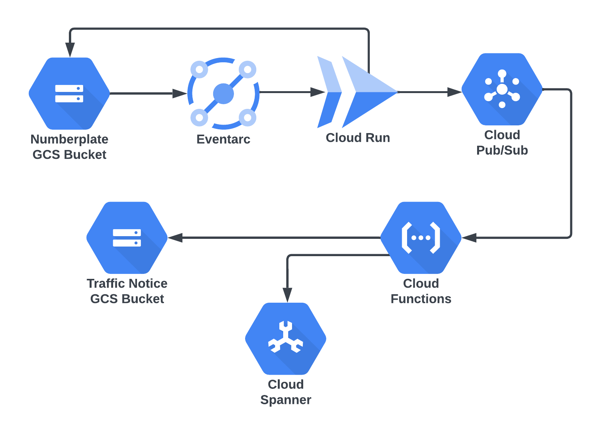

# Chapter 5 - Serverless Solutions in GCP

## Final Project : Speeding ticket - Number plate scanning and ticket generation

### Objective

Traffic control cameras capture overspeeding vehicles and their owners will subsequently get a speeding ticket to pay a fine.  This project will use GCP serverless services to implement a trimmed down version that carries out number plate scanning and speeding ticket generation.

### Architecture Diagram



### Implimentation Steps

   * The captured number plate images will be uploaded to a Google cloud storage bucket
   * An Eventarc rule will be triggered due to this upload event and will subsequently invoke a cloudrun application.
   * The CloudRun application will process the image and extract the number plate, which will be sent to a PubSub topic.
   * The Pub/Sub message will trigger a cloud function that will pick up the owner details from a cloud spanner database, generate a PDF report and upload it into another cloud bucket for further processing.

## Setup Instructions

_We will run all these instruction from a [google cloud shell](https://cloud.google.com/shell) - an online shell and developer workspace with integrated GCP authentication.  A working google cloud account is pre-requisite for implementing these instructions_

### Create the new project, enable required services and set  variables

You need to create a google project first - which is a container for all the resources you create for this.  The project ID should be globally unique, so make sure to modify the following varaible accordingly.

```
PROJECT_ID="packt-serverless201-xyz"
gcloud projects create ${PROJECT_ID}
gcloud config set project ${PROJECT_ID}
```

Once the project is created, you will have to enable billing for this project from the GCP Cloud Console.  Select the new project name from the upper left side of the console, and it will show a button to enable billing.  Once done, procceed to next step.

Enable all GCP services required by this project

```
gcloud services enable \
cloudbuild.googleapis.com \
eventarc.googleapis.com \
pubsub.googleapis.com \
run.googleapis.com \
storage.googleapis.com \
spanner.googleapis.com \
artifactregistry.googleapis.com \
cloudfunctions.googleapis.com
```

Create additional vraiables needed for gcloud CLI, and set the default configuration

```
PROJECT_NUMBER=$(gcloud projects describe ${PROJECT_ID} --format='value(projectNumber)')
GCP_REGION="us-central1"

gcloud config set run/region ${GCP_REGION}
gcloud config set run/platform managed
gcloud config set eventarc/location ${GCP_REGION}
gcloud config set functions/region ${GCP_REGION}
```

### Setup service accounts and assign permissions

Assign event arc event receiver to the default compute service account

```
gcloud projects add-iam-policy-binding ${PROJECT_ID} --member=serviceAccount:${PROJECT_NUMBER}-compute@developer.gserviceaccount.com --role=roles/eventarc.eventReceiver
```

Assign pubsub publisher role to storage service agent

```
SERVICE_ACCOUNT=$(gcloud storage service-agent --project=${PROJECT_ID})
gcloud projects add-iam-policy-binding ${PROJECT_ID} \
    --member="serviceAccount:${SERVICE_ACCOUNT}" \
    --role='roles/pubsub.publisher'
```

### Create bucket and Pub/Sub topic

Setup variables

```
NUMPLATE_BUCKET=${PROJECT_ID}-nameplate
SPEEDINGTICKET_BUCKET=${PROJECT_ID}-speedingticket
NUMPLATE_TOPIC=${PROJECT_ID}-platetopic
```
Create buckets, topic and retrive the full path of the topic ( needed for publishing )

```
gcloud storage buckets create gs://${NUMPLATE_BUCKET} --location ${GCP_REGION}
gcloud storage buckets create gs://${SPEEDINGTICKET_BUCKET} --location ${GCP_REGION}
gcloud pubsub topics create ${NUMPLATE_TOPIC}
TOPIC_PATH=$(gcloud pubsub topics describe ${NUMPLATE_TOPIC} --format='value(name)')
```

### Create Cloud Spanner DB, Table and load data

Create the Spanner Instance, Database.  Note that database name cant exceed 30 characters, so modify your dbname accordingly

```
DBINSTANCE=${PROJECT_ID}-spanner-in
DBNAME=${PROJECT_ID}-spdb
TABLE="Owner"

gcloud spanner instances create ${DBINSTANCE} --config=regional-us-central1  --description="Spanner Instance" --nodes=1
gcloud config set spanner/instance ${DBINSTANCE}
gcloud spanner databases create ${DBNAME}
```

Create car owner table and load sample data.  We have two sample number plate images with the numbers given below.  We will upload those two sample images to trigger the entire workflow later in the tutorial

```
gcloud spanner databases ddl update ${DBNAME}  --ddl="CREATE TABLE ${TABLE} ( NumPlate STRING(512) NOT NULL, Name STRING(1024) NOT NULL, Email STRING(1024), Phone INT64 NOT NULL ) PRIMARY KEY (NumPlate)"

gcloud spanner rows insert --database=${DBNAME}  --table=${TABLE} --data=NumPlate=MH12DE1433,Name='John Doe',Email='johndoe@nodomain.com',Phone=9012345678

gcloud spanner rows insert --database=${DBNAME}  --table=${TABLE} --data=NumPlate=CCC444,Name='Jane Doe',Email='janedoe@nodomain.com',Phone=9112345678

```

### Deploy the cloud run service

We will deploy the cloud run service and add a storage trigger that will run the code when an image is uploaded to the GCP bucket ${NUMPLATE_BUCKET}

Checkout the tutorial repo

```
git clone git@github.com:PacktPublishing/Architecting-Serverless-Solutions-for-Enterprise.git
cd Architecting-Serverless-Solutions-for-Enterprise/chapter-5
```

Deploy the cloud run function

```
cd anpr
gcloud builds submit --tag gcr.io/${PROJECT_ID}/anpr-processor; 
gcloud run deploy anpr-processor  --image gcr.io/${PROJECT_ID}/anpr-processor  	--allow-unauthenticated --set-env-vars TOPIC_PATH=${TOPIC_PATH}
```

### Setup an eventarc rule to trigger anpr-processor

Eventarc rule for triggering anpr-processor cloud run service on every image upload to the storage bucket

```
 gcloud eventarc triggers create numberplate-upload-trigger \
     --destination-run-service=anpr-processor \
     --destination-run-region=${GCP_REGION} \
     --event-filters="type=google.cloud.storage.object.v1.finalized" \
     --event-filters="bucket=${NUMPLATE_BUCKET}" \
     --service-account=${PROJECT_NUMBER}-compute@developer.gserviceaccount.com \
     --location ${GCP_REGION}
```

### Deploy Cloud Function to generate speeding ticket

Deploy the cloud function that will repond to the pubsub message and generate the speeding ticket

```
cd ../ticket-generator
gcloud functions deploy ticket-generator --trigger-topic=${NUMPLATE_TOPIC} --gen2 --runtime=python311 --region=${GCP_REGION} --source=. --entry-point=numplate_handler --set-env-vars TICKET_BUCKET=${SPEEDINGTICKET_BUCKET},DBNAME=${DBNAME},DBINSTANCE=${DBINSTANCE},TABLE=${TABLE}

```

### Test entire workflow by uploading two images

Upload the numberplate images to the bucket to trigger the entire workflow

```
cd ..
gsutil cp plate-images/CCC444.jpg gs://${NUMPLATE_BUCKET}
gsutil cp plate-images/MH12DE1433.jpg gs://${NUMPLATE_BUCKET}
```

Verify the pipeline has worked by listing the speeding tickets in the destinatin bucket as follows:

```
gsutil ls  gs://${SPEEDINGTICKET_BUCKET}
```

If everything worked as expected, you will see the following output ( your bucket name will vary )

```
gs://packt-serverless201-xyz-speedingticket/CCC444.pdf
gs://packt-serverless201-xyz-speedingticket/MH12DE1433.pdf
```

You can download these PDFs from the cloud console to veiw them.  If you run into problems, use Log Explorer service to view logs and see what errors are showing up.
