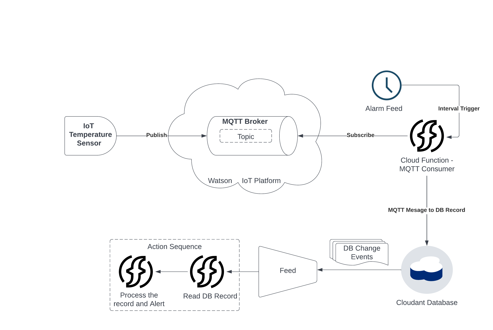

# IoT and Event Processing with IBM Cloud Functions ( OpenWhisk )

The purpose of this project is to collect temperature information send by an IoT sensor, persistently store them for future analysis, and also send out near-real-time alerts when the temperature crosses a specific threshold.

## Architecture

The overall project can be broken down into following tasks

1. Create IBM Watson Platform Instance and add the device
2. Create the IBM Cloudant instance and database
3. Create the consumer cloud function
4. Create the alerting cloud function

Once these subtasks are completed, we proceed to use feeds to schedule the functions and test the pipeline end to end using the pseudo IoT device ( python script )

